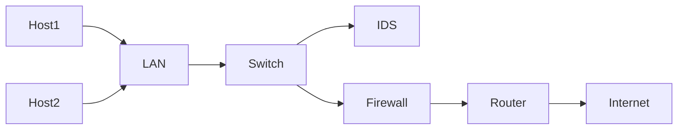
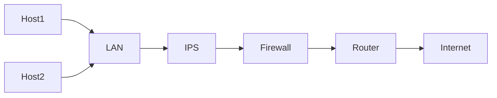

# Introduction to Cybersecurity

**Cybersecurity** is the ongoing effort to protect individuals, organizations and governments from digital attacks by protecting networked systems and data from unauthorized use or harm.

*3 Levels of Protection*:
- **Personal**: You need to safeguard your identity, data and your computing devices
- **Organizational**: Its everyone's responsibility to protect the data, reputation and customers
- **Govenrment**: Gathering and sharing of digital information is putting national security, economic stability and wellbeing of citizens at stake.

*Types of Identity*:
- **Online**: Its about who you are and how you present yourself online. It includes the usernames, aliases and the social identity you set on different platforms.
- **Offline**: It is the real life persona that you present on daily basis, as a result the people who know you knows about your personal life etc.

_Note: Many people think that not having an account on social platforms makes their identity safe, truth is using web gives you an online identity_

**Tips to generate usernames:**
- Don't use your full name or parts of your PII (Personal Identifiable Information)
- Don't use email username
- Don't use the same username and password combination especially on fiancial a/c
- Don't choose super odd username and reuse it repeatedly. it makes easier to track
- Don't choose a username that gives clues to your passwords.
- Do choose a username that's appropriate for the type of a/c - business, social or personal

**Personal Data**: It describes any information about you, including your **name, social security number, driver's licence number, date and place of birth,** and many other stuff.
These data are being used for impersonation purposes
- Medical EHRs (Electronic Health Records stored by hospitals in their DBs and records collected by fitness trackers) reveals a lot about your mental and physical wellness which contains data like:
	- Blood sugar level
	- Heart rate
	- glucose level
	- blood pressure
	- sleeping time
	- medications in need
- Education records contains data like:
	- educational qualification
	- achievements
	- institute name and address
	- attendance report
	- contact numbers
	- health and immunization records
	- IEPs (Individualized education programs)
- Emplyment and Financial records includes data like:
	- Income
	- Expenditures
	- Tax records
	- banking statements
	- paychecks are of great interest to attackers.

**Journey your data is going through**

_Case1_ : Following an appointment, the doctor will update your medical records. For billing purposes this information may be shared with insurance company. In such cases your EHR is accessible at the insurance company.

_Case2_ : Store loyalty cards may be a convenient way to save money on your purchases. However, the store is using this card to build a profile of your purchasing behavior, which it can then use to target you with special offers from its marketing partners.

**Medical Theft:** Rising medical costs led hackers in stealing medical insurances to use the benefits for themselves
**Banking Theft:** Stealing private data can lead to expose of crucial banking information and the hacker can impersonate and take out loans and can file a tax return.

**Who else steals your data?**
- ISP: Internet Service Providers tracks your online activity and sells it to the advertisers for profit.
- Advertisers: They track your online activity and shows you ad regarding your preferences.
- Search engines and social media: They gather info based on gender, search history, religious ideologies, geolocation, phone number and sells it to the advertisers for greater profit.
- Websites: It uses cookies to track your activites which leaves of trails of data which might come in hand of advertisers.

**Types of Organizational Data:**
- **Traditional Data**: Generated and maintained by all organizations
	- **Transactional data**: Details related to buying and selling, production activites and basic organizational operations such as any information used to make employment decisions.
	- **Intellectual Property**: Patents, Trademarks and new product plans which allows an organization to gain economic advantage over its competitors. This is considered a trade secret and losing it could prove disastrous.
	- **Financial Data**: Income statements, balance sheets and cash flow statements which provide insights into the health of a company.
- **IOT and Big Data**: Huge amt. data generated by users which are stored and managed by MNCs for analysis purposes.

**McCumber Cube Framework**:
- **Confidentiality:** It is a set of rules that prevents sensitive information from being disclosed to unauthorized people, resources and processes.
	- Data Encryption
	- Identity Theft
	- 2F Auth are the methods that ensures confidentiality
- **Integrity:** Ensures that sustem information or processes are protected from intentional or accidental modification. _One way to ensure integrity is to use a hash function or checksum._
- **Availability:** Means that authorized users are able to access systems and data when and where needed and those that do not meet the requirement are not. This can be achieved by:
	- Maintaining equipment
	- Performing hardware repairs
	- Keeping OS
	- Software up to date
	- Creating backups

**Protection of information in each state:**
- **Processing**: Refers to data that is being used to perform an operation such as updating a database record.
- **Storage**: Refers to data stored in memory or storage devices
- **Transmission**: Refers to data travelling between information systems

**The security measures used to protect data**
- Awareness, Training and education
- Technology
- Policy and procedure

**Consequences of Data Breach**:
- **Reputational damage**: A security breach can have a negative long-term impact on an organization’s reputation. Customers might turn to secure competitor and employees might leave the company.
- **Vandalism**: Vandalizing an organization’s website by posting untrue information. They might even just make a few minor edits to your organization’s phone number or address, which can be trickier to detect which is unprofessional at times.
- **Theft**: Stealing of information from a data breach
- **Loss of Revenue**: Hackers taking down an online business site leading to major financial losses.
- **Damaged Intellectual Property**: A security breach could also have a devastating impact on the competitiveness of an organization, particularly if hackers are able to get their hands on confidential documents, trade secrets and intellectual property.

**Security Breach**: It is an incident that results in unauthorized access to data, applications, services or devices, exposing private information that attackers can use for financial gain or other advantages.

**Types Of Attackers:**
- **Amateurs**: Kids or newbies having no experience in cybersecurity but are highly overmotivated and their actions consiously or unconsiously causes devastating outcome.
- **Hackers**: This group of attackers break into computer systems or networks to gain access. Depending on the intent of their break in, they can be classified as:
	- **White Hat**: break into networks or computer systems to identify any weaknesses so that the security of a system or network can be improved.
	- **Black Hat**: take advantage of any vulnerability for illegal personal, financial or political gain.
	- **Grey Hat**: may set out to find vulnerabilities in a system but they will only report their findings to the owners of a system if doing so coincides with their agenda.
- **Organized Hackers:** These attackers include organizations of cyber criminals, hacktivists, terrorists and state-sponsored hackers. They are usually highly sophisticated and organized, and may even provide cybercrime as a service to other criminals.
	- **Hacktivists**: They make political statements to create awareness about issues that are important to them.
	- **State-sponsored**: They gather intelligence or commit sabotage on behalf of their government. They are usually highly trained and well-funded and their attacks are focused on specific goals that are beneficial to their government.

**Types Of Threats:**
- **External**: Amateur or Skilled attackers attacking an industry by exploiting vulnerabilities.
- **Internal**: Employees and other internal members of industry exposing confidential data to the outside data.

**Cyberwarfare:** Using technology and techniques to hack or penetrate other nation's computer system in order to cause some damage or disrupt.

_Case Study: STUXNET_
States sponsored attack involved the Stuxnet malware that was designed not just to hijack targeted computers but to actually cause physical damage to equipment controlled by computers!

**The Purpose of cyberwarfare:**
The main reason for resorting to cyberwarfare is to gain advantage over adversaries (one's opponent), whether they are nations or competitors.

Cyberwarfare are used to:
- gather compromised information and/or defense secrets
- impact another nation’s infrastructure

**Types Of Malware:**

Malware - is any code that can be used to steal data, bypass access controls, or cause harm to or compromise a system.

- **Spyware**:
	- Designed to track and spy on you
	- It monitors your online activity and can log every key press.
	- It also captures some senstive PIIs.
	- It often bundles itself with legitimate software or Trojans
- **Adware:**
	- Designed to automatically deliver ads to a user (especially on web browser)
	- Its often delivered with spywares or comes installed with some specific software version updates.
- **Backdoor:** 
	- Used to gain unauthorized access by bypassing the normal authentication procedures to access a system.
	- It can gain remote access to resources within an application and issue remote system commands.
	- It works in background and is difficult to detect.
- **Ransomeware:**
	- Used to hold a computer system or the data it contains captive until a payment is made
	- It encrypts your data so that it becomes inaccessible
	- Often spread through phishing emails
- **Scareware:**
	- Used to scare the victim in order to perform a specific task
	- Consists of mainly windows style pop-up to warn you that your system is at risk and needs to run a specific program for it to return to normal operation.
- **Rootkit:**
	- Designed to modify the OS to create a backdoor which attackers use to access the PC remotely
	- It mostly takes advantages of software vulnerabilities to gain access to resources that normally shouldn't be accessible.
	- It can also modify system forensics and monitoring tools, making them very hard to detect.
- **Virus:** 
	- A computer program that replicates and attaches itself to other executables by inserting its own code.
	- It mostly requires end-user's initiation or can be written to act on a specified date and time.
	- They can be of both harmful or harmless nature.
- **Trojan Horse:**
	- Carries out malicious operations by masking its true intent.
	- Might appear legitimate but can be very dangerous
	- Mostly used for PrivEsc purposes and are often found attached with Audio/Video files.
	- They don't self-replicate
- **Worms:**
	- It replicates itself inorder to spread from one computer to another.
	- It doesn't require any host to initiate it. It can run by its own.
	- It can spread very quickly over the network

**Symptoms of Malware Attack:**
- Increase in CPU Usage
- Freezing and crashing of your PC
- Decrease in Web browsing speed
- Unexplainable problems with network connections
- Modified/Deleted files
- Presence of unknown files, programs or desktop icons
- Unknown process running
- Programs turning off or reconfiguring themselves
- Emails or activity done without your consent

**Methods Of Infiltration:**
- ***Social Engineering:*** Technique of manipulating people to perform certain action leading to divulging confidential information.
	- ***Pretexting***: This is when an attacker calls an individual and lies to them in an attempt to gain access to privileged data.
	- ***Tailgating:** This is when an attacker quickly follows an authorized person into a secure, physical location.
	- ***Something for something (quid pro quo)***: This is when an attacker requests personal information from a person in exchange for something, like a free gift.

- ***Denial Of Service:*** Denial-of-Service (DoS) attacks are a type of network attack that is relatively simple to carry out, even by an unskilled attacker. A DoS attack results in some sort of interruption of network service to users, devices or applications.
	- ***Overwhelming quantity of traffic:*** This is when a network, host or application is sent an enormous amount of data at a rate which it cannot handle. This causes a slowdown in transmission or response, or the device or service to crash.
	- ***Maliciously formatted packets***: When a maliciously formatted packet is sent, the receiver will be unable to handle it. For example, if an attacker forwards packets containing errors or improperly formatted packets that cannot be identified by an application, this will cause the receiving device to run very slowly or crash.
	*Note: DoS attacks are considered a major risk because they can easily interrupt communication and cause significant loss of time and money.*

-  ***Distributed DoS:*** A Distributed DoS (DDoS) attack is similar to a DoS attack but originates from multiple, coordinated sources.

- ***Botnet:*** A bot computer is typically infected by visiting an unsafe website or opening an infected email attachment or infected media file. A botnet is a group of bots, connected through the Internet, that can be controlled by a malicious individual or group. It can have tens of thousands, or even hundreds of thousands, of bots that are typically controlled through a command and control server.

- ***On-Path Attack***: On-path attackers intercept or modify communications between two devices, such as a web browser and a web server, either to collect information from or to impersonate one of the devices.
	- ***MITM:*** A MitM attack happens when a cybercriminal takes control of a device without the user’s knowledge. With this level of access, an attacker can intercept and capture user information before it is sent to its intended destination. These types of attacks are often used to steal financial information.
	- *MITMO:* A variation of man-in-middle, MitMo is a type of attack used to take control over a user’s mobile device. When infected, the mobile device is instructed to exfiltrate user-sensitive information and send it to the attackers. e.g.: Zeus

- ***SEO Poisioning:*** The most common goal of SEO poisoning is to increase traffic to malicious sites that may host malware or attempt social engineering.

- ***Brute-force attacks***: Testing possible password combinations to try and guess a password. 
- ***Network Sniffing:*** To identify unencrypted passwords by listening in and capturing packets sent on the network.

- ***Password Attacks:*** Entering a username and password is one of the most popular forms of authenticating to a web site. Therefore, uncovering your password is an easy way for cybercriminals to gain access to your most valuable information.
	- ***Password Spraying:*** This technique attempts to gain access to a system by ‘spraying’ a few commonly used passwords across a large number of accounts.
	- ***Dictionary Attacks:*** A hacker systematically tries every word in a dictionary or a list of commonly used words as a password in an attempt to break into a password-protected account.
	- ***Brute-force Attacks:*** The simplest and most commonly used way of gaining access to a password-protected site, brute-force attacks see an attacker using all possible combinations of letters, numbers and symbols in the password space until they get it right.
	- ***Rainbow Attacks:*** A rainbow table is a large dictionary of precomputed hashes and the passwords from which they were calculated.
	- ***Traffic Interception:*** Plain text or unencrypted passwords can be easily read by other humans and machines by intercepting communications.

*Tools: Ophcrack, L0phtCrack, THC Hydra, RainbowCrack or Medusa*

- ***APT:*** Advanced Persistent Threat is usually well-funded and typically targets organizations or nations for business or political reasons.
- ***Security Vulnerability:*** Security vulnerabilities are any kind of software or hardware defect.
- ***Exploit:*** A program written to take advantage of a known vulnerability is referred to as an exploit.

**Hardware Vulnerabilities:** Introduces due to design flaw
* Vulnerability named *Rowhammer* was created based on design flaw of RAM which is a type of memory consists of closely installed capacitors. So, repeatedly accessing a row of memory, the Rowhammer exploits triggers electrical interferences that eventually corrupt the data stored inside the RAM
* Vulnerability named *Meltdown & Spectre* discovered by Google that affects almost all CPUs. Attackers exploiting these vulnerabilities can read all memory from a given system (Meltdown), as well as data handled by other applications (Spectre). The Meltdown and Spectre vulnerability exploitations are referred to as side-channel attacks.

**Software Vulnerabilities:** Introduces due to logical and secure code implementation flaw.
- ***Buffer Overflow***: Buffers are memory areas allocated to an application. A vulnerability occurs when data is written beyond the limits of a buffer. By changing data beyond the boundaries of a buffer, the application can access memory allocated to other processes. This can lead to a system crash or data compromise, or provide escalation of privileges.
- ***Non-Validated Input:*** Programs often require data input, but this incoming data could have malicious content, designed to force the program to behave in an unintended way.
- ***Race Condition:*** This vulnerability describes a situation where the output of an event depends on ordered or timed outputs. A race condition becomes a source of vulnerability when the required ordered or timed events do not occur in the correct order or at the proper time.
- ***Weakness in security practices:*** Developers should stick to using security techniques and libraries that have already been created, tested and verified and should not attempt to create their own security algorithms. These will only likely introduce new vulnerabilities.
- ***Access Control Problems:*** Access control is the process of controlling who does what and ranges from managing physical access to equipment to dictating who has access to a resource, such as a file, and what they can do with it, such as read or change the file.

**Cryptocurrency:** Cryptocurrency is digital money that can be used to buy goods and services, using strong encryption techniques to secure online transactions.

- Cryptocurrency owners keep their money in encrypted, virtual ‘wallets.’ When a transaction takes place between the owners of two digital wallets, the details are recorded in a decentralized, electronic ledger or blockchain system. This means it is carried out with a degree of anonymity and is self-managed, with no interference from third parties such as central banks or government entities.
- Approximately every ten minutes, special computers collect data about the latest cryptocurrency transactions, turning them into mathematical puzzles to maintain confidentiality. These transactions are then verified through a technical and highly complex process known as ‘mining.’ This step typically involves an army of ‘miners’ working on high-end PCs to solve mathematical puzzles and authenticate transactions
- Once verified, the ledger is updated and electronically copied and disseminated worldwide to anyone belonging to the blockchain network, effectively completing a transaction.
***CryptoJacking:*** It hides on a user’s computer, mobile phone, tablet, laptop or server, using that machine’s resources to 'mine’ cryptocurrencies without the user's consent or knowledge.

**Protecting your computing devices:**
- Turn the firewall on
- Install antivirus and antispyware
- Manage your operating system and browser
- Set up password protection

Iot devices can also pose a greater risk. Since iot devices has their own software, so if any vulnerability exists it would make the problem worse. Also, IoT devices works on Internet, so gaining a control over any IoT device would lead to gaining access on the network and any incoming or outgoing data communication.

SSID: Shortened for Service Set Identifier - is the name of your wireless network.
Even we can configure our network devices to hide the SSID, but hackers could still identify it and its password as well.
Furthermore, you should encrypt wireless communication by enabling wireless security and the WPA2 encryption. Though its still vulnerable :)

**Security flaw in WPA2 in 2017:** This vulnerability can be exploited by Key Reinstallation attACKS (KRACKs). Where the attackers break the encryption between a wireless router and a wireless device, giving them access to network data. This flaw affects all modern, protected Wi-Fi networks.

To mitigate this situation, you should:
-   update all wireless capable devices such as routers, laptops and mobile devices, as soon as security updates become available
-   use a wired connection for any devices with a wired network interface card (NIC)
-   use a trusted virtual private network (VPN) service when accessing a wireless network.

**Simple tips when choosing a strong password:**
- Do not use dictionary words or names in any languages
- Do not use any common misspellings of dictionary words
- If possible, use special characters such as !@#$%^& etc.
- Do not use computer names or account names
- Use a password with more than ten characters

Even consider using passphrase to avoid password cracking. E.g.: Acat th@tlov3sd0gs. Making it easier to remember and less vulnerable to brute-force or dictionary attack

**Few tips on creating a good passphrase:**
- Choosing a statement that is meaningful to you
- Add special characters such as ! @ # $ % ^ & ( )
- The longer the better
- Avoid common or famous statements like a song line etc.

***NIST: National Institute of Standards & Technology*** is a part of US Dept. of Commerce. It's cybersecurity framework helps business of all sizes for better understand and handle their cybersecurity risk and incidents.

NIST provided some password improvement guidelines:
- Password should be at least eight characters but no more than 64 characters.
- Easily guess passwords like 'pass123' should be avoided
- There should be no composition rules such as having to include lower and uppercase letters and numbers
- Users should be able to see when typing passwords to help improve accuracy
- All printing characters and spaces should be allowed
- There should be no passwords hints
- There should be no password expiration period
- There should be no knowledge-based authentication, such as answers to secret questions etc.

**Encryption:** The process of converting information into a form in which unauthorized parties cannot read it.
Software programs are used to encrypt files, folders and even entire drives.

***Encrypting File System (EFS)*** is a Windows feature that can encrypt data. It is directly linked to a specific user account and only the user that encrypts the data will be able to access it after it has been encrypted using EFS.

**Steps to Encrypt a file/folder in Windows:**
- Select one or more files/folders
- Right click the selected data and click on Properties
- Click on Advanced
- Select Encrypt contents to secure data check box

**Backing Up Data**:
1. Home Network: Storing your data locally
2. Secondary Location: Devices like USB, CDs, NAS etc.
3. Cloud: Services like Azure, AWS etc.

The ***Terms of Service***, also known as Terms of Use or Terms and Conditions, is a legally binding contract that governs the rules of the relationship between you, the service provider and others who use the service.

The Terms of Service will include a number of sections, from user rights and responsibilities to disclaimers and account modification terms.:
1. **Data Policy:** The data use policy outlines how the service provider will collect, use and share your data.
2. **Privacy Settings:** The privacy settings allow you to control who sees information about you and who can access your profile or account data.
3. **Security Policy:** The security policy outlines what the company is doing to secure the data it obtains from you.

**Factors should you consider before you sign up to an online service:**
-   Have you read the Terms of Service?
-   What are your rights regarding your data?
-   Can you request a copy of your data?
-   What can the provider do with the data you upload?
-   What happens to your data when you close your account?

Additional safety measures to be taken:
- Two-Factor Authentication
- OAuth - an open standard protocol that allows you to use your credentials to access third-party applications without exposing your password.

**Security Appliances:** Standalone devices that run on a network device
- **Router:** Used for interconnect various network segments. Also provide traffic filtering capabilities.
- **Firewall:** Used to look deeper into the network traffic itself and identify malicious behavior that has to be blocked.
- **IPS:** Intrusion Prevention System uses a set of traffic signatures that match and block malicious traffic and attacks.
- **VPN:** Virtual Private Network let remote employees use a secure encrypted tunnel from their mobile computer and securely connect back to the organization's network.
- **Antimalware/Antivirus:** These systems use signatures or behavioral analysis of applications to identify and block malicious code from being executed.
- **Other security devices:** It includes web and email appliances, decryption devices, client access control servers and security management systems.

***Example of security appliances:***

-   **Cisco Integrated Services Router (ISR) 4000**. These routers have many capabilities, including traffic filtering, the ability to run an intrusion prevention system (IPS), encryption and VPN capabilities for secure encrypted tunneling.
    
-   **Cisco’s Firepower 4100 Series** is a next generation firewall that has all the capabilities of an ISR router, as well as advanced network management and analytics. It can help you to see what’s happening on the network so that you can detect attacks earlier.
    
-   **Cisco’s AnyConnect Secure Mobility Client** is a VPN system that lets remote workers use a secure encrypted tunnel from their mobile computer to securely connect back to the organization’s network. All Cisco security appliances are equipped with a VPN server and client technology, designed for secure encrypted tunneling.
    
-   **Cisco’s Advanced Malware Protection (AMP)** is installed in next generation Cisco routers, firewalls, IPS devices and web and email security appliances. It can also be installed as software in host computers.

**Firewalls:** A firewall is designed to control or filter which communications are allowed in and which are not allowed. A firewall can be installed on a single computer or it can be a standalone network of computers and all of the host devices on that network.

**Different types of Firewalls:**
- ***Network layer firewall:*** This filters communication based on source and destination IP addr.
- ***Transport layer Firewall:*** This filters communications based on source and destination data ports, as well as connection states.
- ***Application layer firewall:*** This filters communications based on an application, program or service.
- ***Context aware layer firewall:*** This filters communication based on the user, device, role, application type and threat profile.
- ***Proxy Server:*** It filters web content requests like URLs, domain names and media types.
- ***Reverse Proxy server:*** It is placed in front of web servers, reverse proxy servers protect, hide, offload and distribute access to web servers.
- ***NAT Firewall:*** This firewall hides or masquerades the private addresses of network hosts.
- ***Host-based firewall:*** Filters ports and system service calls on a single computer operating system.

**Ports:** In networking, each application running on a device is assigned an identifier called a port number. e.g.: HTTP works on 80, HTTPS on 443, SSH on 22, FTP on 20 & 21.

**IDS:**

- An IDS can either be a dedicated network device or a tool in a server, firewall or even a host OS such as Win, Linux that scans against the database of rules or attack signatures, looking for malicious traffic
- If a match is detected, the IDS will log the detection and create an alert for a network admin.
- The scanning performed by the IDS slows down the network known as **Latency**. 
- To prevent latency, IDS is usually placed offline, separate from regular network traffic. Data is copied or mirrored by a switch and then forwarded to the IDS for offline detection.

**IPS:**

- IPS can block or deny traffic based on a positive rule or signature match. One of the most well-known IPS/IDS system is **Snort**.
- Commercial version of Snort is Cisco's Sourcefire
- Sourcefire can perform real-time traffic and port analysis, logging, content searching and matching, as well as detect probes, attacks and execute port scans. It also integrates with other third-party tools for reporting, performance and log analysis.

- Best way of defending against zero-day attacks and APTs is to use an enterprise level advanced malware detection solution like **Cisco's AMP(Advanced Malware Protection) Threat Grid**

**Benefits of Cisco AMP Threat Grid:**
- SOC Team can gather more accurate and actionable data
- IR Team has access to forensically sound information from which it can more quickly analyze and understand suspicious behaviors.
- Threat Intel. Team can proactively improve the org's securoty infrastructure.
- Sec Infra Engg Team is able to consume and act on the threat info faster, often in an automated way.

**Best Security Practices:**
- Perform Risk assessment
- Create a security policy
- Physical security measures
- Human resource Security measures
- Perform and test backups
- Maintain security patches and updates
- Employ access controls
- Regularly test incident response
- Implement a network monitoring, analytics and management tool
- Implement network security devices
- Implement a comprehensive endpoint security solution
- Educate users
- Encrypt data

**NetFlow:**
NetFlow technology is used to gather information about data flowing through a network, including who and what devices are in the network, and when and how users and devices access the network.

NetFlow is an important component in behavior-based detection and analysis. Switches, routers and firewalls equipped with NetFlow can report information about data entering, leaving and traveling through the network. 

This information is sent to NetFlow collectors that collect, store and analyze NetFlow data, which can be used to establish baseline behaviors on more than 90 attributes, such as source and destination IP address.

**PenTesting Process:**
- Planning
- Scanning
- Gaining Access
- Maintaining Acess
- Analysis & Reporting

**Actions organizations should take when a security breach is identified:**
- Communicate the issue
- Be sincere and accountable
- Provide the details
- Find the cause
- Apply lessons learned
- Check and check again
- Educate

**Risk Management:** Risk management is the formal process of continuously identifying and assessing risk in an effort to reduce the impact of threats and vulnerabilities.

**Risk Management Procedure:**
- Frame the risk: Identify the threats that increase risk.
- Assess the risk: Determine the severity that each threat poses.
- Respond to the risk: Develop an action plan to reduce overall organization risk exposure, detailing where risk can be eliminated, mitigated, transferred or accepted.
- Monitor the risk: Continuously review any risk reduced through elimination, mitigation or transfer actions.

***Remember:***

-   An **IPS** can block or deny traffic based on a positive rule or signature match.
-   An **IDS** scans data against a database of rules or attack signatures, looking for malicious traffic.
-   A **DLP** system is designed to stop sensitive data from being stolen from or escaping a network. 
-   A **SIEM** system collects and analyzes security alerts, logs and other real-time and historical data from security devices on the network.

